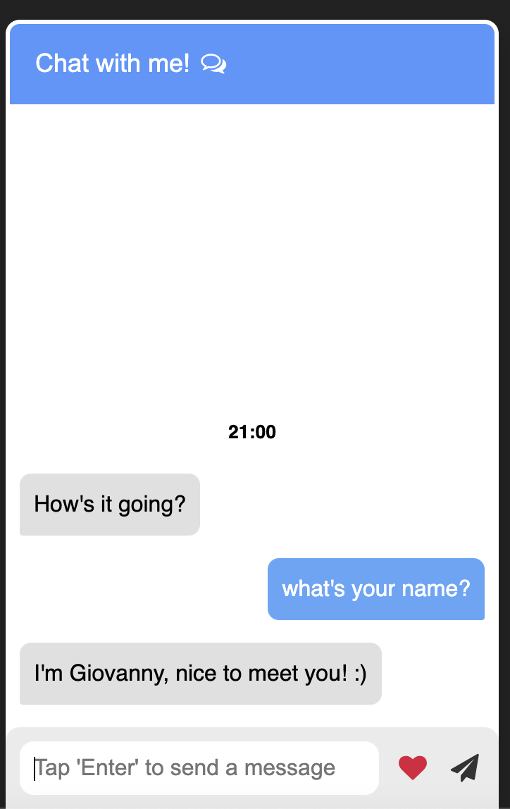

<p align="center">
    
</p>

<h1 align="center">Messenger Bot</h1>

<div align="center">
A program that allows you to chat with a bot (me) </br></br>
</div>

### 📲 Project idea: Messenger APp

## 🌟 Features/Concepts Learned

- 💻 HTML display as screen/mobile
- 📊 learned how to refer using jQuery.
- 💻 Implementation of chats in the UI.
- 🖱 Learned css concepts. (Hide/show chat, message pop up)
- ⏰ Add current time to chat.
- ➕ Learned appending elements
- 💬 learned how to let bot display a message.
- 💬 Learned how to let the user input display as a message. 


## 📂 Technologies Used

### Frontend

- HTML
- CSS

### Backend

- Javascript

## 🗣 About

Grab the `Questions to ask` file and chat with me.


### ⚒️ Set Up

```
# Open code editor (VS Code)
dowload git project and open it.

# run the code with live server
make sure you have live server installed as a extension on VS code.

```

## 📌 Authors

🧑🏽‍💻 **Giovanny Hernandez** - Coded the program along with Palace.

🧑🏽‍💻 **Code Palace** - Explanation into the program.

